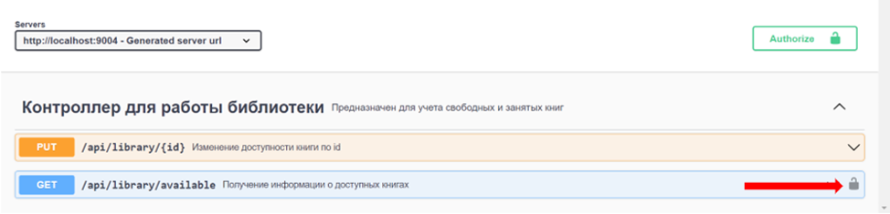
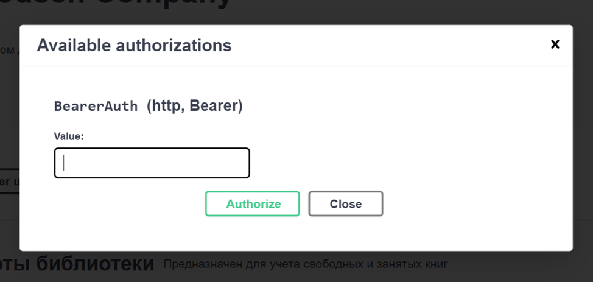

# LIBRARY API
___
## Описание приложения
___
В созданном приложении реализован основной и дополнительный функционал, прописанный в технических требованиях.  Для написания приложения выбрана микросервисная архитектура. Помимо сервисов, осуществляющих работу непосредственно с информацией о книгах, был реализован авторизационный сервис, в котором пользователь получает JWT токен для дальнейшей работы с микросервисами.

Базы данных были подключены к сервисами реализующим основной и дополнительный функционал. В авторизационном сервисе информация о пользователе после выдачи токена не сохраняется.

Для хранения информации о книгах в третьей нормальной форме (неключевые атрибуты зависят только от первичного ключа), информация об имени, фамилии и отчестве автора книги была вынесена в отдельную таблицу, над которой имеется возможность проводить CRUD операции, обращаясь к микросервису книг.

Добавление нового автора происходит автоматически, если при добавлении автор с указанным ФИО еще не существует в таблице.

___
## Запуск
___

Перед запуском приложения необходимо изменить логин, пароль и хост, на котором запущена 
база данных, в файлах application.yml у сервисов book-service и 
library-service.

Данное приложение является микросервисным, поэтому его запуск надо начать с сервиса discovery-service,
после чего запускаются config-service, gateway-service, auth-service,
book-service и library-service.

Микросервисы запускаются на следующих портах:

+ discovery-service: 8761
+ config-service: 9297
+ gateway-service: 8080
+ auth-service: 9001
+ book-service: 9003
+ library-service: 9004

Дефолтные порты также можно изменить в файлах application.yml соответствующих микросервисов.

___
## Авторизация
___

Использование API Gateway позволило создать общий порт для обращения к микросервисам(8080).
На нем была настроена защита endpoint-ов с использованием JWT. 

Для получения токена необходимо отправить POST запрос по адресу ``/auth/register`` с логином и паролем,
после чего полученный токен надо будет передавать в header запросов к микросервисам
(key=Authorization), чтобы получать или отправлять данные.

Так как запросы на микросервисы отправляются не напрямую, а через API Gateway,
получение токена из заголовка и его валидация были настроены именно в gateway-service.

___ 
## Описание работы со Swagger
___

К проекту был подключен Swagger, опэтому при переходе по адресу 
http://localhost:9003/swagger-ui/index.html#/ (для book-service),
http://localhost:9004/swagger-ui/index.html#/ (для library-service),
http://localhost:9001/swagger-ui/index.html#/ (для auth-service)
открывается страница с документацией и интерфейсом для тестирования endpoint-ов соответствующего микросервиса.

Swagger настроен таким образом, что отправляет запросы напрямую к сервисам, минуя API Gateway.
Во время тестирования приложения с помощью Swagger нет необходимости отправлять JWT 
в заголовках запросов. Такая необходимость возникает только в случаях, еасли после запроса на микросервис он делает запрос к другому сервису
через API Gateway, на котором будет происходить валидация токена.

Существует 3 endpoint-а, для которых при тестировании через Swagger 
необходимо передавать заголовок Authorization. В Swagger они помечены знаком замка, при нажатии
на который появляется поле для ввода токена.

Для тестирования использовался Postman, в этом случае тестирование методов осуществляется по порту 8080, 
поэтому авторизационный токен нужно передавать для всех запросов.

